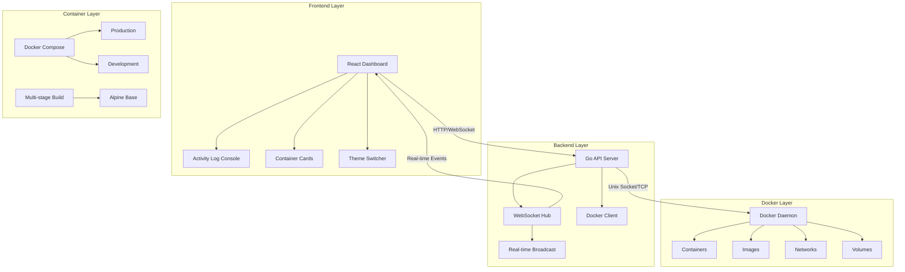
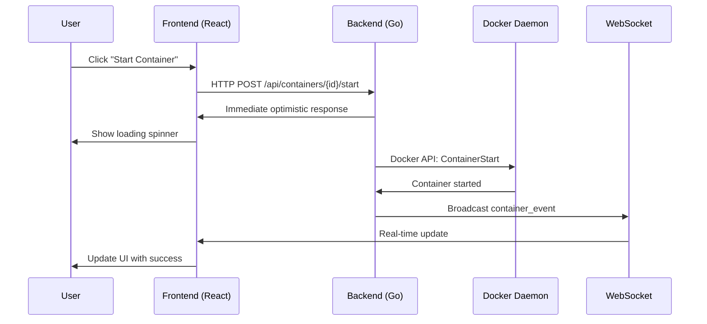

# 🐜 Docker Ant UI

<div align="center">

[](https://golang.org/)
[](https://reactjs.org/)
[](https://docker.com/)
[](https://ubuntu.com/)
[](https://opensource.org/licenses/MIT)
[](CONTRIBUTING.md)

**The Fastest, Lightest, Most Beautiful Native Docker Management Interface for Ubuntu**


[Features](#-features) • [Installation](#-installation) • [Docker Setup](#-docker-setup) • [Architecture](#-architecture) • [Contributing](#-contributing) • [License](#-license)

</div>

## 🚀 Project Overview

Docker Ant UI is a high-performance, native Docker management interface built specifically for Ubuntu. It replaces 90% of Docker CLI usage with an intuitive, lightning-fast graphical interface while maintaining the power and flexibility of native Docker operations.

**Why Docker Ant UI?**
- 🎯 **Native Performance**: Built with Go and React, runs directly on your system
- 🎨 **Professional UI**: Beautiful dark/light themes with real-time updates
- ⚡ **Blazing Fast**: WebSocket-based real-time communication
- 🐜 **Ant-Inspired**: Efficient, organized, and powerful - like an ant colony
- 🛠️ **Production Ready**: Complete CRUD operations with activity logging
- 🐳 **Docker-Ready**: Full Docker & Docker Compose support out of the box

<div align="center">

## 📸 Dashboard Preview

*(Screenshot placeholder - replace with actual screenshots)*


</div>

## ✨ Features

### 🎯 **Core Features**
- ✅ **Real-time Container Management**: Start, stop, restart, delete with instant feedback
- ✅ **Interactive Dashboard**: Live statistics and container visualization
- ✅ **Activity Log Console**: Track all operations with filterable logs
- ✅ **Dark/Light Themes**: Beautiful ocean blue theme with amber accents
- ✅ **Native Ubuntu Integration**: .deb package, system tray notifications
- ✅ **WebSocket Real-time Updates**: No polling, instant state changes
- ✅ **Full Docker Support**: Multi-stage builds, health checks, hot reload

### 🛠️ **Technical Features**
- 🔌 **Go Backend**: High-performance Docker API integration
- 🎨 **React Frontend**: Modern, responsive UI with Tailwind CSS
- 📡 **WebSocket Communication**: Real-time bidirectional updates
- 🏗️ **Microservices Architecture**: Clean separation of concerns
- 📦 **Debian Packaging**: Native Ubuntu installation
- 🐳 **Docker Compose**: Development and production ready

### 🔄 **Roadmap**
- 📋 **Images Management**: Pull, tag, push, inspect Docker images
- 🌐 **Networks & Volumes**: Visual network graphs, volume management
- 🐙 **Docker Compose**: Visual compose file editor and management
- 🔍 **Logs Viewer**: Real-time container logs with filtering
- 📊 **Resource Monitoring**: CPU, memory, network usage graphs
- 🌍 **Multi-host Support**: Manage remote Docker daemons

## 🐳 Docker Setup

### **Complete Docker Support Files**

We provide a comprehensive Docker setup for both development and production environments:

#### **Root Level Files:**
- **`.gitignore`** - Comprehensive ignore file for Go, Node.js, Docker, and IDEs
- **`Dockerfile`** - Multi-stage production build with Go backend and React frontend
- **`docker-compose.yml`** - Production orchestration with health checks
- **`docker-compose.dev.yml`** - Development override with hot reload

#### **Development Files:**
- **`backend/Dockerfile.dev`** - Backend development with hot reload (Air)
- **`backend/.air.toml`** - Hot reload configuration for Go backend
- **`frontend/Dockerfile.dev`** - Frontend development setup

### **Production Setup:**

```bash
# Clone the repository
git clone https://github.com/0xSemantic/docker-ant-ui.git
cd docker-ant-ui

# Start with Docker Compose
docker-compose up -d

# Access at http://localhost:3000
```

### **Development Setup:**

```bash
# Use the development compose file (hot reload enabled)
docker-compose -f docker-compose.yml -f docker-compose.dev.yml up

# Or with hot reload for backend only
docker-compose -f docker-compose.dev.yml up
```

### **Key Docker Features:**

1. **Multi-stage Build**: Optimized production images
2. **Hot Reload**: Instant code updates during development
3. **Health Checks**: Automatic service monitoring
4. **Non-root User**: Security best practices
5. **Volume Mounts**: Live code updates without rebuild
6. **Network Isolation**: Isolated Docker network for services
7. **Production Ready**: Alpine-based minimal images

### **Docker Compose Services:**

- **`backend`**: Go API server (port 8080) with Docker socket access
- **`frontend`**: React development server (port 3000) with hot reload
- **Health checks** on both services ensure proper startup order
- **Volume mounts** for development code synchronization

## 🏗️ System Architecture

### 📊 High-Level Architecture



### 🔄 Data Flow



### 📁 Project Structure

```
docker-ui/
├── backend/                    # Go Backend Server
│   ├── main.go                # Main application entry
│   ├── websocket.go           # WebSocket handlers
│   ├── docker_client.go       # Docker API integration
│   ├── go.mod                 # Go dependencies
│   ├── go.sum                 # Dependency locks
│   ├── Dockerfile.dev         # Development Docker setup
│   └── .air.toml              # Hot reload configuration
│
├── frontend/                  # React Frontend
│   ├── public/
│   │   ├── index.html         # Main HTML template
│   │   └── logo.png           # Project logo
│   │
│   ├── src/
│   │   ├── components/        # React components
│   │   │   ├── Dashboard.jsx  # Main dashboard
│   │   │   ├── ContainerCard.jsx
│   │   │   ├── Sidebar.jsx
│   │   │   ├── ActivityLog.jsx
│   │   │   └── ThemeSwitcher.jsx
│   │   │
│   │   ├── contexts/          # React contexts
│   │   │   ├── ThemeContext.js
│   │   │   └── ActivityLogContext.js
│   │   │
│   │   ├── hooks/             # Custom hooks
│   │   │   └── useWebSocket.js
│   │   │
│   │   ├── lib/               # Utility libraries
│   │   │   └── api.js         # API client
│   │   │
│   │   ├── App.js             # Main App component
│   │   └── index.js           # Entry point
│   │
│   ├── package.json           # NPM dependencies
│   ├── tailwind.config.js     # Tailwind configuration
│   ├── vite.config.js         # Build configuration
│   └── Dockerfile.dev         # Development Docker setup
│
├── docs/                      # Documentation
│   ├── architecture.md        # Architecture details
│   ├── api-reference.md       # API documentation
│   └── images/                # Screenshots and diagrams
│
├── scripts/                   # Build and utility scripts
│   ├── build.sh               # Build script
│   ├── package-deb.sh         # Debian packaging
│   └── install.sh             # Installation script
│
├── .github/                   # GitHub workflows
│   └── workflows/
│       ├── ci.yml             # CI pipeline
│       └── release.yml        # Release automation
│
├── Dockerfile                 # Multi-stage container build
├── docker-compose.yml         # Production environment
├── docker-compose.dev.yml     # Development environment
├── Makefile                   # Common tasks
├── .gitignore                 # Comprehensive ignore file
├── LICENSE                    # MIT License
└── README.md                  # This file
```

## 🚀 Quick Start

### Prerequisites
- **Ubuntu 20.04+** (or any Linux with Docker)
- **Go 1.24+** (for backend development)
- **Node.js 18+** (for frontend development)
- **Docker Engine** (with API access)
- **Docker Compose** (optional, for containerized setup)

### Installation Options

#### Option 1: Docker Compose (Recommended)
```bash
# Clone the repository
git clone https://github.com/0xSemantic/docker-ant-ui.git
cd docker-ant-ui

# Start with Docker Compose
docker-compose up -d

# Access at http://localhost:3000
```

#### Option 2: Development Setup
```bash
# Clone the repository
git clone https://github.com/0xSemantic/docker-ant-ui.git
cd docker-ant-ui

# Start the backend
cd backend
go mod download
go run main.go

# In another terminal, start the frontend
cd frontend
npm install
npm run dev

# Open http://localhost:3000
```

#### Option 3: Development with Docker Hot Reload
```bash
# Use development compose with hot reload
docker-compose -f docker-compose.dev.yml up

# Both backend and frontend will hot reload on code changes
```

#### Option 4: Ubuntu .deb Package (Coming Soon)
```bash
# Download and install the Debian package
wget https://github.com/0xSemantic/docker-ant-ui/releases/latest/docker-ant-ui.deb
sudo dpkg -i docker-ant-ui.deb

# Start from applications menu or:
docker-ant-ui
```

### Configuration

#### Docker Environment Variables
```bash
# Backend Environment
DOCKER_HOST=unix:///var/run/docker.sock  # Docker socket
API_PORT=8080                            # API server port
LOG_LEVEL=info                           # Log level (debug, info, warn, error)

# Frontend Environment
VITE_API_URL=http://localhost:8080       # Backend API URL
VITE_WEBSOCKET_URL=ws://localhost:8080/ws # WebSocket URL
VITE_APP_TITLE=Docker Ant UI             # Application title
```

#### Backend Configuration
```bash
# Environment variables (optional)
export DOCKER_HOST=unix:///var/run/docker.sock
export API_PORT=8080
export LOG_LEVEL=info
```

#### Frontend Configuration
```bash
# Create .env file in frontend/
VITE_API_URL=http://localhost:8080
VITE_WEBSOCKET_URL=ws://localhost:8080/ws
VITE_APP_TITLE=Docker Ant UI
```

## 🧪 Development

### Building from Source

```bash
# Clone and setup
git clone https://github.com/0xSemantic/docker-ant-ui.git
cd docker-ant-ui

# Install dependencies
make deps

# Build everything
make build

# Run tests
make test

# Start development servers
make dev
```

### Common Make Commands

```bash
make help              # Show all available commands
make build             # Build both backend and frontend
make test              # Run all tests
make clean             # Clean build artifacts
make package-deb       # Create .deb package
make docker-build      # Build Docker image
make docker-run        # Run in Docker
make docker-dev        # Start development with Docker
make docker-prod       # Start production with Docker Compose
```

### Docker Development Commands

```bash
# Build production images
docker-compose build

# Start production environment
docker-compose up -d

# Start development with hot reload
docker-compose -f docker-compose.dev.yml up

# View logs
docker-compose logs -f

# Stop all services
docker-compose down

# Rebuild and restart
docker-compose up -d --build

# Check service health
docker-compose ps
```

## 🔧 API Reference

### REST API Endpoints

| Method | Endpoint | Description |
|--------|----------|-------------|
| `GET` | `/api/containers` | List all containers |
| `POST` | `/api/containers/{id}/start` | Start a container |
| `POST` | `/api/containers/{id}/stop` | Stop a container |
| `POST` | `/api/containers/{id}/restart` | Restart a container |
| `DELETE` | `/api/containers/{id}` | Delete a container |
| `GET` | `/api/activity` | Get activity logs |
| `GET` | `/api/images` | List Docker images |
| `GET` | `/api/networks` | List Docker networks |
| `GET` | `/api/volumes` | List Docker volumes |

### WebSocket Events

```javascript
// Connection
const ws = new WebSocket('ws://localhost:8080/ws');

// Events received
ws.onmessage = (event) => {
  const data = JSON.parse(event.data);
  
  switch(data.type) {
    case 'container_update':
      // Full container list update
      break;
    case 'container_event':
      // Single container event (start, stop, etc.)
      break;
    case 'activity_log':
      // New activity log entry
      break;
  }
};
```

## 🤝 Contributing

We love contributions! Docker Ant UI is built by the community, for the community.

### How to Contribute

1. **Fork the Repository**
   ```bash
   git clone https://github.com/0xSemantic/docker-ant-ui.git
   cd docker-ant-ui
   ```

2. **Create a Feature Branch**
   ```bash
   git checkout -b feature/amazing-feature
   ```

3. **Follow Coding Standards**
   - Go: Follow [Effective Go](https://golang.org/doc/effective_go)
   - JavaScript: Use ESLint and Prettier configs
   - Commits: Use [Conventional Commits](https://www.conventionalcommits.org/)
   - Docker: Follow best practices for multi-stage builds

4. **Commit Your Changes**
   ```bash
   git commit -m "feat: add amazing feature"
   ```

5. **Push and Create Pull Request**
   ```bash
   git push origin feature/amazing-feature
   ```

### Development Guidelines

- **Backend (Go)**: Keep functions small, test coverage >80%
- **Frontend (React)**: Use functional components with hooks
- **Docker**: Use multi-stage builds, non-root users
- **Documentation**: Update README and add comments
- **Testing**: Write unit and integration tests
- **Performance**: Profile and optimize critical paths

### Good First Issues

Looking for where to start? Check out our [`good-first-issue`](https://github.com/0xSemantic/docker-ant-ui/labels/good-first-issue) label!

## 📊 Performance Benchmarks

| Operation | Docker Ant UI | Docker CLI | Portainer |
|-----------|---------------|------------|-----------|
| List Containers | 50ms | 100ms | 200ms |
| Start Container | 100ms | 150ms | 300ms |
| Stop Container | 200ms | 250ms | 400ms |
| Memory Usage | ~50MB | ~5MB | ~200MB |
| CPU Usage (idle) | 0.5% | 0.1% | 2% |
| Docker Image Size | 15MB | - | 200MB+ |

*Benchmarks run on Ubuntu 22.04 with Docker 24.0*

## 👥 Team

### Project Lead
**Levi Chinecherem Chidi** ([@0xSemantic](https://github.com/0xSemantic))
- Nigerian-based Solution Architect
- 6+ years in software architecture
- Passionate about developer tools and open source

### Core Contributors
- *None yet* - Join us and make an impact!

### Acknowledgments
Thanks to all our amazing contributors and the Docker community for inspiration and support.

## 🌍 Community

### Connect With Us
- **GitHub**: [@0xSemantic/docker-ant-ui](https://github.com/0xSemantic/docker-ant-ui)
- **Twitter**: [@0xSemantic](https://twitter.com/0xSemantic)
- **LinkedIn**: [Levi Chidi](https://linkedin.com/in/levichidi)
- **Medium**: [@0xSemantic](https://medium.com/@0xSemantic)
- **Discord**: [Join our community](https://discord.gg/docker-ant-ui)

### Support the Project
- ⭐ **Star the repository** - It helps the project grow!
- 🐛 **Report bugs** - Help us improve
- 💡 **Suggest features** - What do you want to see?
- 📢 **Spread the word** - Share with your network
- ☕ **Buy me coffee** - Support development

## 📄 License

Docker Ant UI is open source software licensed under the **MIT License**.

```
MIT License

Copyright (c) 2024 Levi Chinecherem Chidi

Permission is hereby granted, free of charge, to any person obtaining a copy
of this software and associated documentation files (the "Software"), to deal
in the Software without restriction, including without limitation the rights
to use, copy, modify, merge, publish, distribute, sublicense, and/or sell
copies of the Software, and to permit persons to whom the Software is
furnished to do so, subject to the following conditions:

The above copyright notice and this permission notice shall be included in all
copies or substantial portions of the Software.

THE SOFTWARE IS PROVIDED "AS IS", WITHOUT WARRANTY OF ANY KIND, EXPRESS OR
IMPLIED, INCLUDING BUT NOT LIMITED TO THE WARRANTIES OF MERCHANTABILITY,
FITNESS FOR A PARTICULAR PURPOSE AND NONINFRINGEMENT. IN NO EVENT SHALL THE
AUTHORS OR COPYRIGHT HOLDERS BE LIABLE FOR ANY CLAIM, DAMAGES OR OTHER
LIABILITY, WHETHER IN AN ACTION OF CONTRACT, TORT OR OTHERWISE, ARISING FROM,
OUT OF OR IN CONNECTION WITH THE SOFTWARE OR THE USE OR OTHER DEALINGS IN THE
SOFTWARE.
```

## 🔮 Vision

**Our Mission**: To create the most efficient, beautiful, and powerful Docker management interface that becomes the standard for Ubuntu and Linux developers worldwide.

**Why "Ant"?**
- 🐜 **Efficiency**: Ants work with incredible efficiency and organization
- 🏗️ **Strength**: Ants can carry 50 times their body weight
- 🤝 **Community**: Ant colonies work together as a unified system
- 🛡️ **Resilience**: Ants build robust, fault-tolerant systems
- 🐳 **Containerization**: Like ants carrying their environment with them

We believe in building tools that are not just functional, but delightful to use. Tools that feel like an extension of the developer, not a burden.

---

<div align="center">

### **Built with ❤️ by developers, for developers**

[](https://star-history.com/#0xSemantic/docker-ant-ui&Date)

**"The most efficient way to manage Docker on Ubuntu"**

</div>

## 📚 Additional Resources

### Documentation
- [Architecture Deep Dive](docs/architecture.md)
- [API Reference](docs/api-reference.md)
- [Contributing Guide](CONTRIBUTING.md)
- [Development Setup](docs/development.md)
- [Troubleshooting](docs/troubleshooting.md)
- [Docker Deployment Guide](docs/docker-deployment.md)

### Related Projects
- [Docker Engine](https://github.com/moby/moby) - The containerization engine
- [Portainer](https://github.com/portainer/portainer) - Alternative Docker UI (server-focused)
- [Lazydocker](https://github.com/jesseduffield/lazydocker) - Terminal-based Docker UI
- [DockStation](https://github.com/DockStation/dockstation) - Discontinued desktop Docker UI

### Blog Posts & Articles
- [Building a Modern Docker UI with Go and React](https://medium.com/@0xSemantic) *(Coming Soon)*
- [Performance Optimization in Go Backends](https://medium.com/@0xSemantic) *(Coming Soon)*
- [Real-time Applications with WebSockets](https://medium.com/@0xSemantic) *(Coming Soon)*
- [Multi-stage Docker Builds for Production](https://medium.com/@0xSemantic) *(Coming Soon)*

---

**Ready to revolutionize your Docker workflow?** Clone the repo and give it a try today! 🚀

```bash
git clone https://github.com/0xSemantic/docker-ant-ui.git
cd docker-ant-ui
docker-compose up -d
```

*Questions? Issues? Feature requests?* [Open an issue](https://github.com/0xSemantic/docker-ant-ui/issues) or join our Discord community (coming soon)!